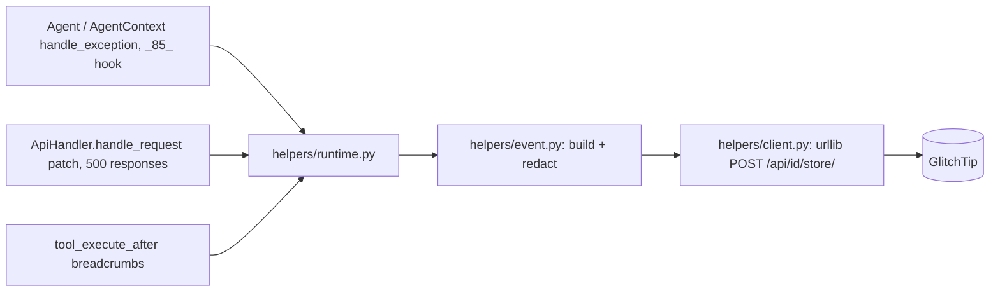

<p align="center">
  <picture>
    <source media="(prefers-color-scheme: dark)" srcset="assets/brand/wordmark-dark.svg">
    
  </picture>
</p>

Reports unhandled [Agent Zero](https://github.com/agent0ai/agent-zero) agent-loop and API exceptions to a self-hosted GlitchTip (Sentry-compatible) instance, tagged with an OTel-format trace ID.

Status: v0.1.0, offline tests only, not yet smoke-tested against a live GlitchTip. See [ROADMAP.md](ROADMAP.md). Zero dependencies (stdlib `urllib` only). Extracted from [Khan](https://github.com/duketopceo/Khan) (issue [Khan#193](https://github.com/duketopceo/Khan/issues/193)).

<!-- TODO: screenshot of the settings panel from a running a0 -->

## Install

```bash
# into a running a0 checkout
git clone https://github.com/duketopceo/a0-plugin-glitchtip \
  <a0>/usr/plugins/glitchtip
```

Enable the plugin in the WebUI plugin list, then configure the DSN.

## Quick start

```bash
export GLITCHTIP_DSN="https://<public_key>@<your-glitchtip-host>/<project_id>"
```

Restart a0, then call `POST /api/plugins/glitchtip/glitchtip_test` (auth and CSRF inherited from a0). It returns `{ok, event_id}`; the event should appear in your GlitchTip project.

## How it works



## Configure

Set the DSN via environment (preferred: keeps it out of config files), or the `dsn` field in plugin settings (`external` section).

A path prefix before the project id is kept — reverse-proxied installs like
`https://host/glitchtip/42` work unchanged. The transport **refuses
redirects** rather than forward the event body + `X-Sentry-Auth` to a
different host; a mis-targeted DSN fails closed (see logs). Prefer `https` —
an `http://` DSN to a non-loopback host logs a warning since event payloads
traverse the network in cleartext.

Settings (from `default_config.yaml`):

| Setting | Env | Default |
|---|---|---|
| `enabled` | — | `true` |
| `dsn` | `GLITCHTIP_DSN` | `""` (empty; plugin inactive) |
| `environment` | `GLITCHTIP_ENV` | `local` |
| `release` | `GLITCHTIP_RELEASE` | — |
| `api_error_events`¹ | — | `true` |
| `breadcrumbs_max` | — | `50` |
| `send_timeout_s` | — | `5` |

¹ `api_error_events` gates only the ≥500 event emission — inbound
`traceparent` adoption and outbound response stamping stay on while the
plugin is active.

## What gets reported

| Source | How | Event |
|---|---|---|
| Tool / agent-loop exceptions | `_85_` extensions on `Agent.handle_exception` and `AgentContext.handle_exception` — after core clears repairable/intervention exceptions, before `_90_` wraps the rest as handled | Real exception event **with stack trace** |
| API handler failures | startup-time wrapper on `ApiHandler.handle_request` observes ≥500 responses (a0 swallows handler exceptions into a 500 body — no stack survives) | Message-level event with path + method |
| Test event | `POST /api/plugins/glitchtip/glitchtip_test` | `{ok, event_id}` |

Every event carries `tags.trace_id` and `contexts.trace` — an OTel-format
trace ID adopted from the inbound `traceparent` header when present, else
minted at capture time (agent loops run on worker threads that never see an
inbound header, so they get fresh traces). Responses to API calls are
stamped with the active `traceparent` so a front end can join the trace.

## Correlating with Langfuse

GlitchTip doesn't link to Langfuse automatically — the correlation is the
shared trace ID:

1. In GlitchTip, open the event → its `trace_id` tag.
2. In Langfuse, search traces for that ID (Langfuse/OTel use the same
   32-hex format). Inbound requests that already carry a `traceparent`
   header keep that trace ID end-to-end, so gateway/front-door traces join
   up automatically.

## Privacy & redaction

- Sensitive request headers are stripped before events ship (auth, cookies,
  CSRF/session tokens, API keys — see `_SENSITIVE_HEADERS` in
  `helpers/event.py`).
- A small always-on pattern scrubber masks common secret shapes (Bearer
  tokens, `sk-*`/`gh*`/`AKIA` keys, `password=…` style assignments, private
  key blocks) inside exception text, messages, and source context lines. If
  `a0-plugin-omaseal` is installed, its `mask_text` registry layers on top.
- This is **best-effort**, not a guarantee — a secret that matches no
  pattern still ships. Keep DSNs scoped to a private GlitchTip and treat
  event payloads as semi-sensitive.
- Breadcrumbs record tool names + statuses only, never args or output —
  forbidden key names are dropped outright.

## Known limitations

- API events are **message-level** (no stack): a0's `ApiHandler` formats
  exceptions into the 500 response before any hook can see the object.
  Agent-loop events carry full stacks.
- No performance/transaction tracing — GlitchTip is error-tracking only.
- **Outages drop events.** One failed POST suppresses sending for 60 s
  (cooldown), and at most 20 captures run concurrently — during a GlitchTip
  outage or an exception storm, some events are intentionally discarded to
  protect the host app.
- Only verified against the Sentry **store** endpoint
  (`POST /api/<id>/store/`); a live self-hosted GlitchTip smoke test is
  recommended after install (`glitchtip_test` API).

## Test

```bash
python -m pytest tests/ -q   # offline; loopback http.server fixture only
```

## Status and roadmap

See [ROADMAP.md](ROADMAP.md) and the [landscape research](docs/research/2026-10-10-landscape.md). Design direction: [DESIGN.md](DESIGN.md) (logo assets are a proposal pending owner sign-off).

## Contributing

Issues and PRs welcome. Keep it stdlib-only and offline-testable; read [AGENTS.md](AGENTS.md) first. Config keys are a three-way sync: `helpers/config.py`, `default_config.yaml`, and the table above.

## Licence

MIT, see [LICENSE](LICENSE).
